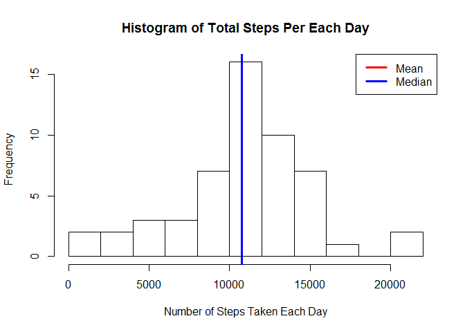

# Reproducible Research: Peer Assessment 1

## Loading and preprocessing the data

```r
# Loading
unzip(zipfile = "activity.zip")
data <- read.csv("activity.csv", colClasses = c("integer", "Date", "factor"))
# Preprocessing
data$month <- as.numeric(format(data$date, "%m")) # create month column
cleanData <- na.omit(data) 
rownames(cleanData) <- 1:nrow(cleanData)
library(ggplot2) # load required library for plots used in code
library(lattice) # required library for panel plot
```

## What is mean total number of steps taken per day?
For this part of the assignment, you can ignore the missing values in the dataset.

* Calculate the total number of steps taken per day

```r
ttlsteps <- aggregate(cleanData$steps, list(Date = cleanData$date), FUN = "sum")$x
head(ttlsteps)
```

```
## [1]   126 11352 12116 13294 15420 11015
```

* Make a histogram of the total number of steps taken each day

```r
hist(cleanData$steps, xlab="Number of Steps Taken Each Day", 
main="Histogram of Number of Steps Taken Each Day")
```



* Calculate and report the mean and median total number of steps taken per day

Mean total number of steps taken per day

```r
mean(ttlsteps)
```

```
## [1] 10766.19
```
Median total number of steps taken per day

```r
median(ttlsteps)
```

```
## [1] 10765
```

## What is the average daily activity pattern?

* Make a time series plot (i.e. type = "l") of the 5-minute interval (x-axis) and the average number of steps taken, averaged across all days (y-axis)


```r
# Aggreagte steps in data frame
x = list(steps = cleanData$steps)
by = list(interval = as.numeric(as.character(cleanData$interval)))
avgDailyActivity <- aggregate(x,by, FUN = "mean")
names(avgDailyActivity)[2] <- "averageSteps"

gTitle <- "Time series plot of 5-minute interval and average number of steps taken"
gYlabel <- "Average number of steps taken"
gXlabel <- "5-minute interval"

ggplot(avgDailyActivity, aes(interval, averageSteps)) + 
  geom_line() + 
  labs(title = gTitle, y = gYlabel, x = gXlabel)
```


* Which 5-minute interval, on average across all the days in the dataset, contains the maximum number of steps?

```r
avgDailyActivity[which.max(avgDailyActivity$averageSteps), ]
```

```
##     interval averageSteps
## 104      835     206.1698
```

## Imputing missing values

Note that there are a number of days/intervals where there are missing values (coded as NA). The presence of missing days may introduce bias into some calculations or summaries of the data.

* Calculate and report the total number of missing values in the dataset (i.e. the total number of rows with NAs)


```r
sum(is.na(data))
```

```
## [1] 2304
```

* Devise a strategy for filling in all of the missing values in the dataset. The strategy does not need to be sophisticated. For example, you could use the mean/median for that day, or the mean for that 5-minute interval, etc.

* Create a new dataset that is equal to the original dataset but with the missing data filled in.


```r
# strategy is to replace the NA values with mean for that 5-minute interval 
filledData <- data 
for (i in 1:nrow(filledData)) 
  {
    if (is.na(filledData$steps[i])) 
      {
        filledData$steps[i] <- avgDailyActivity[which(filledData$interval[i] == avgDailyActivity$interval),]$averageSteps
      }
  }

# Verify no values are NA in new filled dataset
sum(is.na(filledData))
```

```
## [1] 0
```

* Make a histogram of the total number of steps taken each day and Calculate and report the mean and median total number of steps taken per day. 


```r
hist(filledData$steps, xlab="Number of Steps Taken Each Day", 
main="Histogram of Number of Steps Taken Each Day")
```


* Do these values differ from the estimates from the first part of the assignment? What is the impact of imputing missing data on the estimates of the total daily number of steps?

Mean total number of steps taken per day

```r
newttlSteps <- aggregate(filledData$steps, 
                           list(Date = filledData$date), 
                           FUN = "sum")$x
mean(newttlSteps)
```

```
## [1] 10766.19
```
Median total number of steps taken per day

```r
median(newttlSteps)
```

```
## [1] 10766.19
```
Comparison between previous and current mean and median values

```r
# Difference between old (with null values) mean and new mean (with filled in values)
mean(ttlsteps)- mean(newttlSteps)
```

```
## [1] 0
```

```r
# Difference between old (with null values) median and new median (with filled in values)
median(ttlsteps) - median(newttlSteps)
```

```
## [1] -1.188679
```
While the mean of total steps taken per day is unchanged, the median of total steps taken per day has increased. 

## Are there differences in activity patterns between weekdays and weekends?

For this part the weekdays() function may be of some help here. Use the dataset with the filled-in missing values for this part.

* Create a new factor variable in the dataset with two levels - "weekday" and "weekend" indicating whether a given date is a weekday or weekend day.


```r
filledData$weekdays <- factor(format(filledData$date, "%A")) # Add weekday column
head(filledData)
```

```
##       steps       date interval month weekdays
## 1 1.7169811 2012-10-01        0    10   Monday
## 2 0.3396226 2012-10-01        5    10   Monday
## 3 0.1320755 2012-10-01       10    10   Monday
## 4 0.1509434 2012-10-01       15    10   Monday
## 5 0.0754717 2012-10-01       20    10   Monday
## 6 2.0943396 2012-10-01       25    10   Monday
```

```r
# Replace with weekday or weekend depending on day
levels(filledData$weekdays) <- list(weekday = c("Monday", "Tuesday","Wednesday", 
                                                "Thursday", "Friday"),
                                 weekend = c("Saturday", "Sunday"))
head(filledData)
```

```
##       steps       date interval month weekdays
## 1 1.7169811 2012-10-01        0    10  weekday
## 2 0.3396226 2012-10-01        5    10  weekday
## 3 0.1320755 2012-10-01       10    10  weekday
## 4 0.1509434 2012-10-01       15    10  weekday
## 5 0.0754717 2012-10-01       20    10  weekday
## 6 2.0943396 2012-10-01       25    10  weekday
```

Make a panel plot containing a time series plot (i.e. type = "l") of the 5-minute interval (x-axis) and the average number of steps taken, averaged across all weekday days or weekend days (y-axis).

```r
x = filledData$steps
by = list(interval = as.numeric(as.character(filledData$interval)), 
          weekdays=filledData$weekdays)
averageSteps <- aggregate(x, by,FUN="mean")
names(averageSteps)[3] <- "avgSteps"
gYlabel <- "Number of steps"
gXlabel <- "Interval"
xyplot(averageSteps$avgSteps ~ averageSteps$interval | averageSteps$weekdays,
       layout = c(1, 2), type = "l", 
       xlab = gXlabel, ylab = gYlabel)
```


